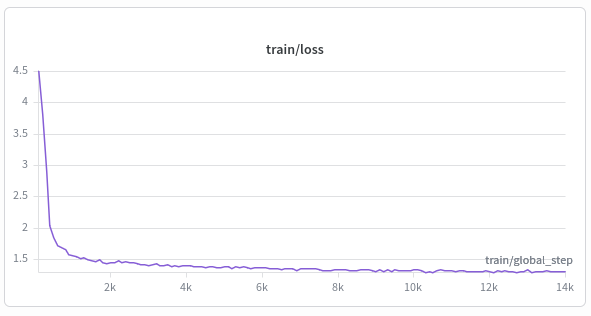
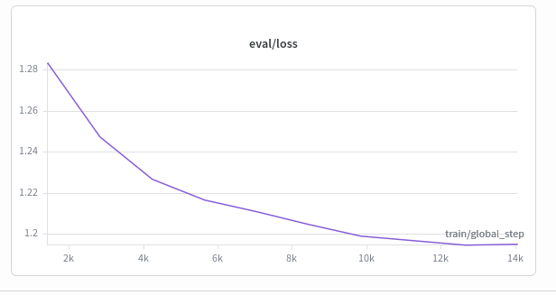
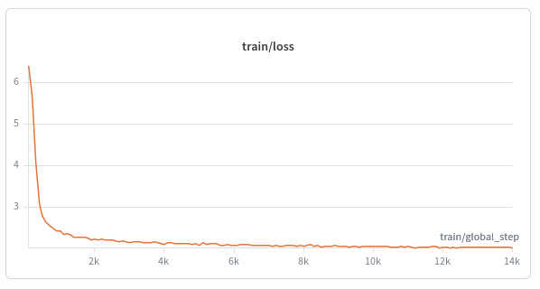
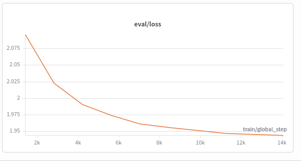

# Quiz Generator: Question-Answer + Distractor Generation

Two independently fine-tuned `google/flan-t5-small` models that together
turn a raw text passage into a complete multiple-choice quiz item: a
question, its answer, and plausible wrong options.

- **qa_pair model** — generates an `answer <sep> question` pair from a
  context, either answer-aware (you supply the answer) or fully automatic
  (the model picks its own salient answer via masking).
- **distractor model** — generates 3 incorrect-but-plausible options given
  a context, question, and correct answer.

Both models are trained and versioned independently, and chained together
at inference time by `QuizGenerator`.

### Why two separate models

Each model is trained on its own dataset, with its own hyperparameters,
and produces its own checkpoint. This keeps the two tasks fully
decoupled training, evaluating, or upgrading one model never risks
affecting the other, and each can be iterated on independently without
re-running the full pipeline.

### Base model

Both models fine-tune `google/flan-t5-small` (77M params), an
instruction-tuned T5 checkpoint. Because it's already instruction-tuned,
it's more sensitive to learning rate than a from-scratch base model a
learning rate that's too high can disrupt its pretrained representations
before the model has a chance to adapt to this task. Current defaults use
`learning_rate=3e-5`, tuned specifically for this base model.

### Prompt format

Each model uses its own fixed instruction prefix since each model only
ever sees one task, the prefix mainly keeps the input format consistent
with T5-style pretraining, and makes raw logged examples easy to read.

**qa_pair**
```
generate question answer: <A or [MASK]>. <C>
→ target: <A> <sep> <Q>

Note:
  A: answer
  Q: question
  C: context
```
- Input field order is answer-first, context-last. Tokenizer truncation
  cuts from the end of the sequence, so placing the short, critical
  answer/mask field before the (often much longer) context protects it
  from being silently dropped when context is long.
- 30% of training rows replace the real answer with `[MASK]` in the input
  (the target still contains the real answer + question). This teaches
  the model two modes at once: answer-aware generation and fully automatic
  generation, where it must pick its own salient answer from the context.

**distractor**
```
generate distractor: <Q> <A> <C>
→ target: <D1> <sep> <D2> <sep> <D3>

Note:
  D1: distractor 1
  D2: distractor 2
  D3: distractor 3
  Q: question
  A: answer
  C: context
```
- Same field-ordering rationale: question and answer (short, critical)
  come before context (long, truncatable).
- Trained entirely on RACE (reading comprehension MCQs, which already
  provide 3 annotated wrong options per question) — no synthetic or
  augmented examples from other sources.

### Results

Latest evaluation, `google/flan-t5-small` base, `learning_rate=3e-5`.

**qa_pair**

| Metric | Overall | Answer-aware mode | Masked (automatic) mode |
|---|---|---|---|
| Answer EM | 0.714 | 0.991 | 0.078 |
| Answer F1 | 0.734 | 0.996 | 0.134 |
| Question BLEU-4 | 15.38 | 18.57 | 7.45 |
| Question ROUGE-L | 0.367 | 0.426 | 0.235 |

The model performs very well when it's given the target answer and only
needs to generate a matching question (answer-aware). It's substantially
weaker at picking a good answer on its own from raw context (masked/
automatic mode) this is the main known gap, see Limitations below.

**distractor**

| Metric | Value |
|---|---|
| distinct-1 | 0.102 |
| distinct-2 | 0.275 |
| validity_rate | 1.0 |

`validity_rate = 1.0` means no generated distractor duplicated the correct
answer in this evaluation run. Diversity (distinct-1/2) is moderate RACE
distractors are often long phrases with some repeated structure, which
naturally caps how varied 3 generated options can be per question.

### Training curves
 
**qa_pair**
 
| Train loss | Eval loss |
|---|---|
|  |  |
 
**distractor**
 
| Train loss | Eval loss |
|---|---|
|  |  |
 
---

## Quickstart

Tested on an **NVIDIA A10 GPU**. A T4 (e.g. free-tier Colab) also works,
but expect meaningfully longer training time — reduce
`per_device_train_batch_size` and/or increase
`gradient_accumulation_steps` in `config.py` if you hit out-of-memory
errors on smaller GPUs.

```python
!git clone https://github.com/fahmiaziz98/multi-task-tuning.git
%cd multi-task-tuning
!pip install --system -q -r requirements.txt

import sys
sys.path.append("./data")
sys.path.append("./src")

import wandb
wandb.login(key=["your api key"])

from huggingface_hub import login
login()

# 1. Build both datasets (qa_pair from SQuAD, distractor from RACE)
!python data/build_dataset.py --output_dir ./data/processed

# 2. Train each model independently
# --model_name, --epochs, and --lr are optional overrides; defaults live in config.py
!python src/train.py --task qa_pair --model_name google/flan-t5-small --epochs 5 --lr 3e-5
!python src/train.py --task distractor --model_name google/flan-t5-small --epochs 8 --lr 3e-5

# 3. Evaluate each model against its own test set
!python src/evaluate.py --task qa_pair \
    --checkpoint ./checkpoints/qa_pair \
    --test_file ./data/processed/qa_pair/test.jsonl \
    --run_id <run_id_from_wandb>

!python src/evaluate.py --task distractor \
    --checkpoint ./checkpoints/distractor \
    --test_file ./data/processed/distractor/test.jsonl \
    --run_id <run_id_from_wandb>
```

If you already have datasets logged as W&B Artifacts and just want to pull
them locally (e.g. a fresh session, or local debugging), skip step 1 and
use:

```python
!python data/load_artifact.py --artifact qa-pair-dataset:latest --output_dir ./data/processed/qa_pair
!python data/load_artifact.py --artifact distractor-dataset:latest --output_dir ./data/processed/distractor
```

## Inference

```python
from inference import QuizGenerator

generator = QuizGenerator(
    qa_pair_checkpoint="fahmiaziz/qa-pair-generator",
    distractor_checkpoint="fahmiaziz/distractor-generator",
)

quiz = generator.generate_quiz(
    context="The mitochondria is the organelle responsible for producing "
            "ATP, the main energy currency of the cell."
)

print(quiz.question)      # "What is the main energy currency of the cell?"
print(quiz.answer)        # "ATP"
print(quiz.distractors)   # 3 generated wrong options
```

`generate_quiz()` also accepts an explicit `answer=` argument to force
answer-aware mode instead of letting the model pick its own answer.

Distractors that exactly match the generated answer (case-insensitive) are
filtered out automatically before being returned — decoding parameters
alone don't guarantee this, so it's enforced as a final application-layer
check in `QuizGenerator.generate_distractors()`.

### Decoding configuration

Both models use diverse beam search with repetition control, rather than
plain greedy or standard beam search, to avoid degenerate repeated output
(e.g. the same phrase generated 3 times in a row):

```python
model.generate(
    **encoded,
    max_length=64,
    num_beams=8,
    num_beam_groups=4,
    diversity_penalty=0.5,
    repetition_penalty=1.3,
    no_repeat_ngram_size=2,
)
```

## Repository structure

```
multi-task-tuning/
├── data/
│   ├── build_dataset.py       # builds both datasets, logs 2 W&B artifacts
│   ├── load_artifact.py        # pulls a dataset artifact into a local folder
│   └── schema.py                # shared TrainingTask/TaskType/token definitions
├── src/
│   ├── config.py                 # TrainingConfig, parameterized by task
│   ├── train.py                   # Seq2SeqTrainer loop, run with --task
│   ├── evaluate.py                 # per-task metrics, logged to W&B
│   └── inference.py                 # QuizGenerator: loads both models, chains them
├── test_quiz_generator.py           # manual sanity-check script, 5 varied contexts
├── requirements.txt
└── README.md
```

## Known limitations

- **qa_pair's fully-automatic (masked) mode is meaningfully weaker** than
  its answer-aware mode (masked answer EM ≈ 0.08 vs answer-aware ≈ 0.99).
  The model is much better at generating a question for a *given* answer
  than at picking a good answer on its own from raw context. Not yet
  addressed — candidate fixes: lowering `MASKING_CHANCE` during dataset
  construction, or training qa_pair for more epochs.
- **Distractor training data is RACE-only.** Correct answers in RACE tend
  to be longer phrases; if this model is used downstream with a qa_pair
  model that produces very short factual answers (single words, numbers),
  distractor quality on that kind of input is untested and may be weaker
  than on RACE-style long-phrase answers.
- **Distractor diversity (distinct-1/2 ≈ 0.10 / 0.28) is moderate.** Partly
  a property of the source data — RACE options often share structure or
  vocabulary within a single question — not purely a model limitation.
- **English only.** No multilingual data or base model in this iteration.
